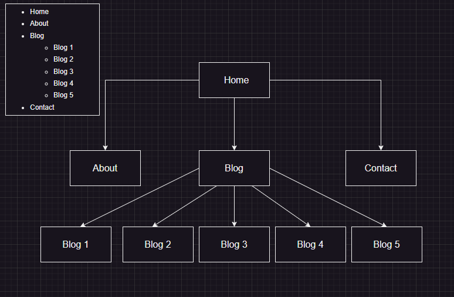
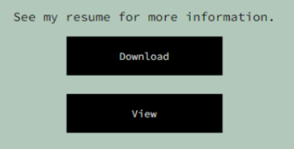
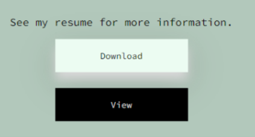
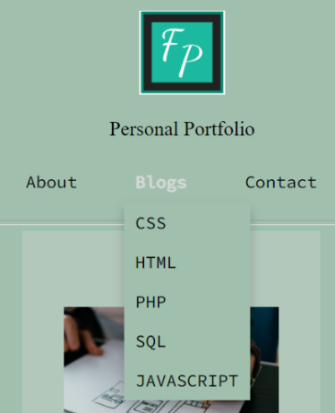
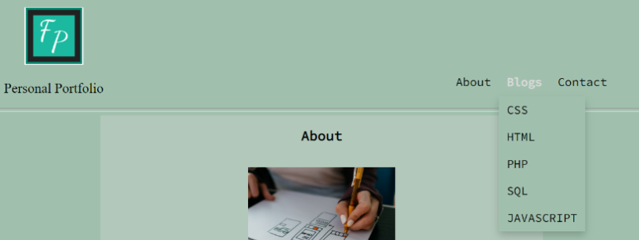
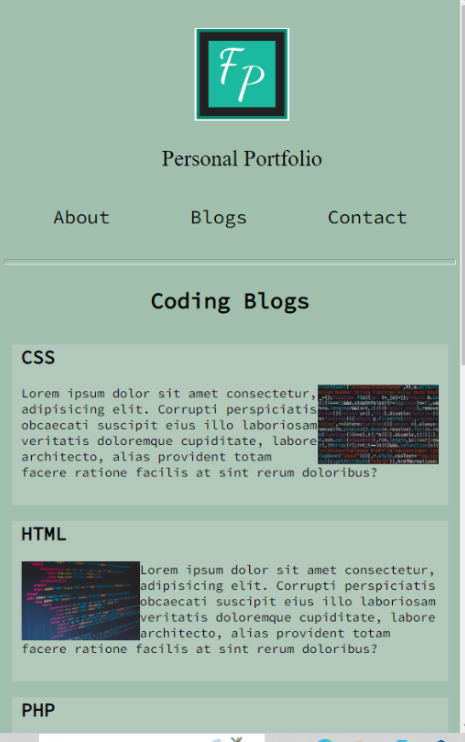
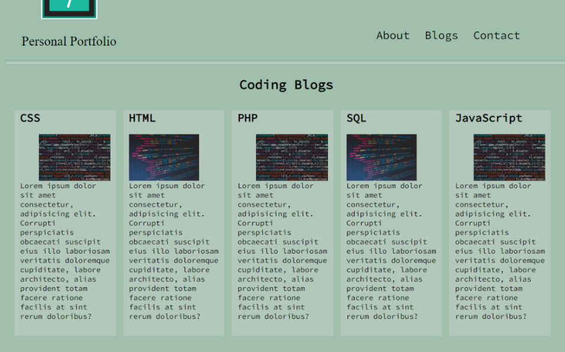

# Personal Portfolio

## Links

* [Deployed Site On Netlify](https://fabianp.netlify.app/)
* [GitHub Repo](https://github.com/fabs-pe/T1A2-Portfolio)
* [Video Presentation]()

## Purpose & Target

The purpose of this portfolio site is to provide information myself, skills  and interest. Also  to display some work and professional knowledge. This site will targeted to potential employers looking to hire a web developer and IT professional.

## Functionality

The following has been used to create my portfolio site:

* HTML
* CSS
* VSCode
* Netlify
* GitHub
* Figma

## Sitemap



## Wireframes

The below are  the wireframes for each page and three different screens sizes.


CSS is used to make the site more intractive.

* In this case :hover is used to change the button

``` css
main section .btn .resume-btn {
  font-family: "Josefin Sans", sans-serif;
  font-family: "Rubik Iso", cursive;
  font-family: "Source Code Pro", monospace;
  height: 50px;
  width: 30%;
  background-color: black;
  color: #D9D9D9;
  border: none;
  margin-bottom: 24px;
}
main section .btn .resume-btn:hover {
  color: black;
  background-color: #ECFCF2;
  box-shadow: 0 12px 16px 0 #D9D9D9, 0 17px 50px 0 rgba(0, 0, 0, 0.19);
}
```

```html
<div class="btn">
                    <p> See my resume for more information.</p>
                    <a href="../images/resume.png" download="Fabians Resume"><button class="resume-btn">Download</button></a> <!--button to download resume-->
                    <a href="../images/resume.png" target="blank"><button type="submit" class="resume-btn">View</button></a> <!--button to view resume-->
                </div>
```

The HTML creates buttons that will let you download a copy of a resume or view in a new tab depending on the button selected. The formatting also changes as the pointer is hovered over, change of background color, font color and add a shadow arounf the button




The nav bar is also designed in a similar way. Changing color when hovered over. A dropdown is also added to the 'Blog' page button, for quick access to other blogs. this helps users navigate the site easier. The lofdo in the header is a link back to the home page and can be clicked from any page.




``` html
            <nav class="nav-items">
                <ul>
                    <li><a href="./pages/about.html">About</a> </li>
                    <li class="dropdown">
                        <a href="./pages/blogs.html" class="dropbtn">Blogs</a>
                        <div class="dropdown-content"> <!--dropdown for blog list-->
                            <a href="./pages/cssblog.html">CSS</a>
                            <a href="./pages/htmlblog.html">HTML</a>
                            <a href="./pages/phpblog.html">PHP</a>
                            <a href="./pages/sqlblog.html">SQL</a>
                            <a href="./pages/javablog.html">JAVASCRIPT</a>
                        </div>
                    </li>
                    <li><a href="./pages/contact.html">Contact</a></li>
                </ul>
            </nav>
```

 Flexbox is used to make the site responsive to different screen sizes. The Blogs page on mobile screen are designed in a coloum with images being floated left or right depending on the div. When viewed on larger screens the divs are displayed in a row across the screen for easier viewing. Most of the website has a breapoint of 600px this page breaaks at a larger 950px. Each div is also a link to its own page. The text changes color on hover as well.

 ```css
     @media screen and (min-width: 950px) { //breaks at a bigger screen size due to format
        section{
            display: flex;
            flex-direction: row; // divs side by side
        

                a{
                    margin-right: 16px;
        
                }

                .blog-even{
                    width:auto; 
                }
                .blog-odd{
                    width:auto; 
                    p{
                        img{
                            float: clear;
                        }
                    }
                }
        }
    }
```




CSS animation is used to make the site more interactive and attractive to the user.

```css
    @keyframes drop-in {
      from {
       opacity: 0;
       transform: translateY(-100px);
      }
      to {
       opacity: 1;
       transform: translate(0px);
      }
     }
```
```css
        @keyframes drop-in {
            from {
             opacity: 0;
             transform: translateY(-100px);
            }
            to {
             opacity: 1;
             transform: translate(0px);
            }
           }
```
